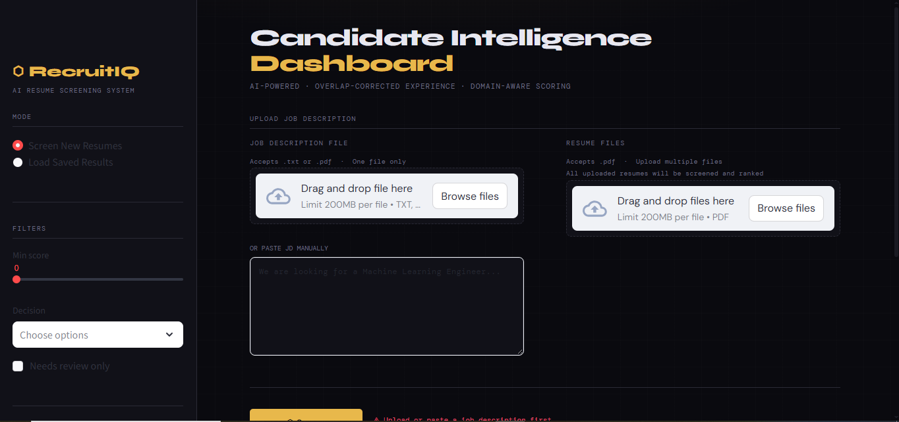

# ⬡ RecruitIQ — AI-Powered Resume Screening System

An end-to-end intelligent Applicant Tracking System (ATS) built with Python and Streamlit. Automatically parses resumes, extracts candidate information, scores applicants against a job description, and ranks them using domain-aware, multi-factor scoring.

Built as a Final Year Project demonstrating applied NLP, semantic similarity, fuzzy matching, and overlap-corrected experience calculation.

---

## Demo



> Upload a job description + resume PDFs → get ranked candidates with skill breakdowns, radar charts, and hiring recommendations in seconds.

---

## Features

- **PDF Parsing** — Extracts text from both digital and scanned PDFs using pdfplumber with automatic OCR fallback via Tesseract
- **Named Entity Recognition** — Three-layer name extraction using spaCy NER, first-line heuristic, and regex fallback
- **Skill Matching** — Three-layer pipeline: exact match → fuzzy match (rapidfuzz) → semantic match (sentence-transformers)
- **Overlap-Corrected Experience** — Merges overlapping job date ranges before calculating total experience, preventing double-counting
- **Role-Specific Experience** — Tracks experience per job role (e.g. "3 years as ML Engineer" vs "5 years total")
- **Domain-Aware Scoring** — Different scoring weights per job type (ML Engineer, Teacher, Data Scientist, etc.)
- **Auto Domain Detection** — Detects job domain from JD keywords; falls back to LLM for unknown domains
- **Interactive Dashboard** — Upload JD + resumes directly in browser, view ranked results with radar charts and skill breakdowns
- **Export** — Download results as CSV or JSON with full score breakdown per candidate

---

## Tech Stack

| Layer | Tools |
|---|---|
| PDF Parsing | pdfplumber, PyMuPDF, pdf2image, Tesseract OCR |
| NLP / NER | spaCy (en_core_web_sm) |
| Embeddings | sentence-transformers (all-MiniLM-L6-v2) |
| Fuzzy Matching | rapidfuzz |
| Date Parsing | python-dateutil |
| Dashboard | Streamlit, Plotly |
| Data | pandas, numpy |

---

## Project Structure

```
AI_powered_Resume_screening/
│
├── src/
│   ├── pdf_parser.py            # PDF text extraction + OCR fallback
│   ├── ner_extractor.py         # Name, email, phone, LinkedIn extraction
│   ├── information_extractor.py # Skills, contact info extraction
│   ├── experience_extractor.py  # Date parsing, overlap correction, role tracking
│   ├── skill_matcher.py         # Three-layer skill matching pipeline
│   ├── matcher.py               # Semantic scoring + weighted final score
│   ├── domain_config.py         # Domain detection + scoring weight profiles
│   ├── ranker.py                # Batch processing, ranking, export
│   ├── batch_test.py            # CLI entry point
│   └── Dashboard.py             # Streamlit dashboard
│
├── resumes/
│   └── data/
│       ├── TEACHER/             # Resume PDFs by category
│       ├── ML_ENGINEER/
│       └── ...
│
├── outputs/                     # Auto-generated JSON + CSV results
├── cache/                       # Embedding cache (auto-generated)
├── requirements.txt
└── README.md
```

---

## Installation

### 1. Clone the repository

```bash
git clone https://github.com/your-username/AI_powered_Resume_screening.git
cd AI_powered_Resume_screening
```

### 2. Create virtual environment

```bash
python -m venv .venv

# Windows
.venv\Scripts\activate

# Mac/Linux
source .venv/bin/activate
```

### 3. Install Python dependencies

```bash
pip install -r requirements.txt
python -m spacy download en_core_web_sm
```

### 4. Install system dependencies (Windows)

**Tesseract OCR** — required for scanned PDFs
```
Download: https://github.com/UB-Mannheim/tesseract/wiki
Install to: C:\Program Files\Tesseract-OCR\
```

**Poppler** — required by pdf2image
```
Download: https://github.com/oschwartz10612/poppler-windows/releases
Extract to: C:\Program Files\poppler-XX.XX.X\
Add bin\ folder to system PATH
```

### 5. Update paths in `pdf_parser.py`

```python
TESSERACT_PATH = r"C:\Program Files\Tesseract-OCR\tesseract.exe"
POPPLER_PATH   = r"C:\Program Files\poppler-XX.XX.X\Library\bin"
```

---

## Usage

### Dashboard (recommended)

```bash
streamlit run src/Dashboard.py
```

1. Select **Screen New Resumes** mode
2. Upload your Job Description (`.txt` or `.pdf`)
3. Upload resume PDFs (multiple files supported)
4. Click **Screen Resumes**
5. View ranked results, download CSV/JSON

### Command Line

```bash
# Screen resumes against a JD file
python src/batch_test.py --jd "path/to/jd.txt" --folder "path/to/resumes"

# Quick test with sample ML Engineer JD
python src/batch_test.py --test
```

---

## Scoring System

Each candidate is scored across four dimensions, weighted by job domain:

| Component | What It Measures |
|---|---|
| **Semantic Score** | Overall resume-JD similarity via sentence embeddings |
| **Skill Score** | Three-layer skill matching (exact + fuzzy + semantic) |
| **Total Exp Score** | Non-linear experience score vs JD requirement |
| **Role Exp Score** | Experience specifically in the target role |

### Domain Weight Profiles

| Domain | Semantic | Skills | Total Exp | Role Exp |
|---|---|---|---|---|
| ML Engineer | 20% | 35% | 15% | 30% |
| Teacher | 35% | 20% | 30% | 15% |
| Data Scientist | 25% | 35% | 15% | 25% |
| Software Engineer | 20% | 40% | 15% | 25% |

### Hiring Decision Thresholds

| Score | Decision |
|---|---|
| ≥ 78% | ⭐ Highly Recommended - Strong-fit |
| ≥ 60% | ✅ Qualified for Interview |
| ≥ 42% | 🟡 Maybe — Review Manually |
| < 42% | ❌ Reject |

---

## Key Technical Contributions

### Overlap-Corrected Experience
Most ATS systems sum all experience mentions directly, causing double-counting when candidates hold simultaneous roles. This system merges overlapping date intervals before calculating total experience:

```
Job A: Jan 2020 – Dec 2022  (3 years)
Job B: Jun 2021 – Jun 2023  (2 years)  ← overlaps with Job A

Naive sum    : 5 years  ✗
Correct total: 3.5 years  ✓
```

### Three-Layer Skill Matching
```
Layer 1 — Exact   : "scikit-learn" == "scikit-learn"        weight: 1.00
Layer 2 — Fuzzy   : "scikit learn" ≈ "scikit-learn"         weight: 0.90
Layer 3 — Semantic: "NLP" ≈ "natural language processing"   weight: 0.75
```

### Domain-Aware Scoring
Automatically detects the job domain from the JD text and applies the appropriate weight profile. Unknown domains fall back to an LLM call for dynamic config generation.

---

## Requirements

```
pdfplumber
pymupdf
pdf2image
pytesseract
spacy
sentence-transformers
torch
rapidfuzz
python-dateutil
pandas
numpy
streamlit
plotly
requests
```

---

## License

This project is developed for academic purposes as a Final Year Project On-demand.

---

## Author

**Umer Aftab**
Final Year Project developed for Student — AI-Powered Resume Screening System
